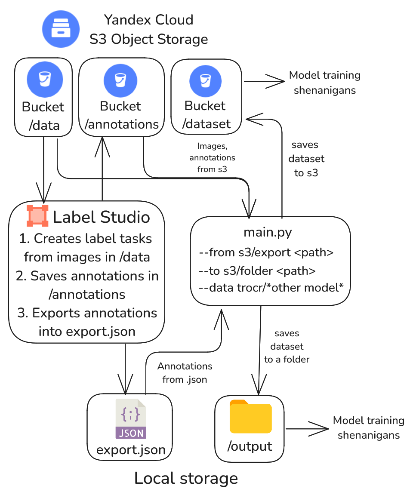

# Dataset formatting script

We use Label Studio to label the data.

- Images are taken from an s3 bucket
- Annotations from Label Studio can be taken from both s3 and .json file
- Resulting dataset can be saved to both s3 and a local folder

# Usage

1. Rename `.env.template` to `.env` and fill the variables you need
2. Create an virtual environment

```bash
python -m venv venv
# for windows:
./venv/Scripts/activate.ps1
# for linux:
source ./venv/bin/activate
```

2. Install dependencies

```bash
pip install -r requirements.txt
```

3. Run `main.py` with parameters:

- `--from source_type path`, source type is s3 or export (Label Studio JSON)
- `--to output_type path`, output type is s3 or folder. You can have multiple outputs at the same time!
- `--data model_type`, dataset variant to generate, defaulted to TrOCR.

<div align="center">
	
</div>
