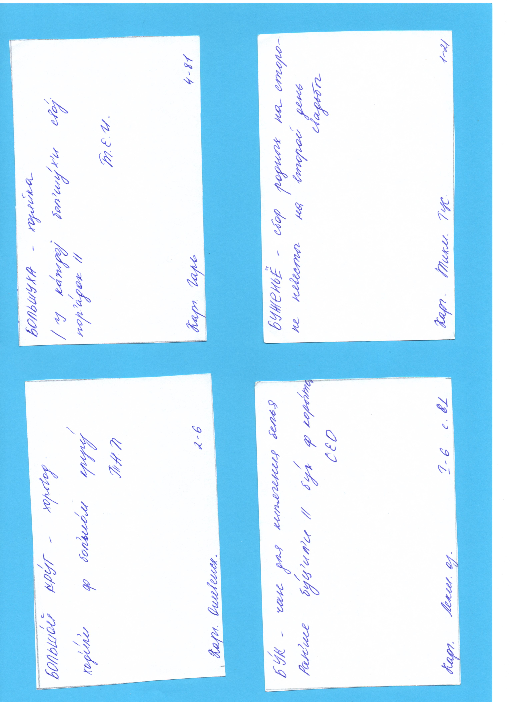

# Scan to card splitter

We scanned 4 cards at the time on a blue-colored paper so we needed a way to extract cards from the scan.

The format of input folder is expected to be alphabet-catalogued folders with scans with them.
The output folder's format is the same alphabet folders but with cards in them.

## Example of an input scan

